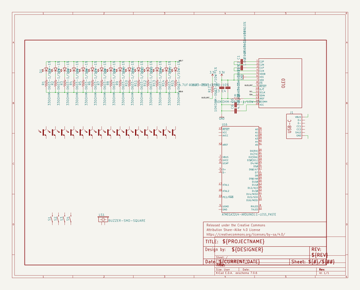
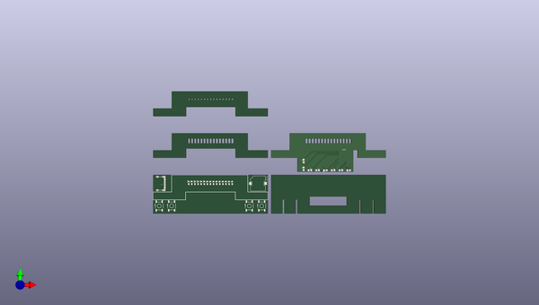

# serinette
 
## summary 
* id: npoole_serinette_serinette
* user: npoole
* name: serinette
* board: serinette
* repo: https://github.com/NPoole/Serinette

* src_file_repo_sch: 
* src_file_repo_sch_link: https://github.com/NPoole/Serinette/tree/main/
* full details link: https://github.com/oomlout/oomlout_oomp_project_bot_v_2/tree/main/projects/npoole_serinette_serinette/current_version/working  

## schematic  
  
[schematic (pdf)](working_schematic.pdf) 

## pcb  
 
  
  
  
[board (pdf)](working.pdf)  

## working_bom
| Id | Designator | Footprint | Quantity | Designation | Supplier and ref |  | None | 
| --- | --- | --- | --- | --- | --- | --- | --- | 
| 1 | U15,U13,U9,U2,U3,U7,U1,U6,U11,U4,U5,U10,U8,U14,U12 | ALS-PT19 | 15 | LIGHT_SENSORALS |  |  | [''] | 
| 2 | S3,S2,S1,S4 | TACTILE_SWITCH_SMD_5.2MM | 4 | MOMENTARY-SWITCH-SPST-SMD-5.2MM-TALL |  |  | [''] | 
| 3 | C3,C6 | 0603 | 2 | 4.7uF |  |  | [''] | 
| 4 | @HOLE5,@HOLE2,@HOLE3,@HOLE14,@HOLE7,@HOLE8,@HOLE11,@HOLE6,@HOLE1,@HOLE0,@HOLE4,@HOLE9,@HOLE12,@HOLE13,@HOLE10 |  | 15 |  |  |  | [''] | 
| 5 | LS1 | BUZZER_SMD | 1 | BUZZER-SMD-SQUARE |  |  | [''] | 
| 6 | C1,C2 | 0603 | 2 | 1.0uF |  |  | [''] | 
| 7 | R17 | 0603 | 1 | 10k |  |  | [''] | 
| 8 | C5 | 0603 | 1 | 2.2uF |  |  | [''] | 
| 9 | C4 | 0603 | 1 | 0.1uF |  |  | [''] | 
| 10 | E$1 | KIKKERLAND15 | 1 |  |  |  | [''] | 
| 11 | OLED1 | OLED-UG-2832TSWGG01-REAR | 1 | 32x128 OLED |  |  | [''] | 
| 12 | R16 | 0603 | 1 | 560K |  |  | [''] | 
| 13 | J1 | USB-C-16P-2LAYER-PADS | 1 |  |  |  | [''] | 
| 14 | FRAME1 | CREATIVE_COMMONS | 1 | FRAME-LETTER |  |  | [''] | 
| 15 | D6,D2,D12,D4,D10,D15,D5,D11,D8,D3,D9,D14,D1,D7,D13 | LED-0603 | 15 |  |  |  | [''] | 
| 16 | R13,R8,R11,R3,R5,R4,R15,R9,R2,R1,R7,R10,R6,R14,R12 | 0603 | 15 | 330 |  |  | [''] | 

## bom_schematic
| Ref | Qnty | Value | Cmp name | Footprint | Description | Vendor | DNP | 
| --- | --- | --- | --- | --- | --- | --- | --- | 
| C1, C2 | 2 | 1.0UF-0603-16V-10% | 1.0UF-0603-16V-10% | working:0603 |  |  |  | 
| C3, C6 | 2 | 4.7UF-0603-35V-(20%) | 4.7UF-0603-35V-(20%) | working:0603 |  |  |  | 
| C4 | 1 | 0.1UF-0603-100V-10% | 0.1UF-0603-100V-10% | working:0603 |  |  |  | 
| C5 | 1 | 2.2UF-0603-10V-20% | 2.2UF-0603-10V-20% | working:0603 |  |  |  | 
| D1, D2, D3, D4, D5, D6, D7, D8, D9, D10, D11, D12, D13, D14, D15 | 15 | LED0603 | LED0603 | working:LED-0603 |  |  |  | 
| FRAME1 | 1 | FRAME-LETTER | FRAME-LETTER | working:CREATIVE_COMMONS |  |  |  | 
| J1 | 1 | USB_C_2-LAYER_PADS | USB_C_2-LAYER_PADS | working:USB-C-16P-2LAYER-PADS |  |  |  | 
| LS1 | 1 | BUZZER-SMD-SQUARE | BUZZER-SMD-SQUARE | working:BUZZER_SMD |  |  |  | 
| OLED1 | 1 | OLED128X64SIDEREAR-MOUNT | OLED128X64SIDEREAR-MOUNT | working:OLED-UG-2832TSWGG01-REAR |  |  |  | 
| R1, R2, R3, R4, R5, R6, R7, R8, R9, R10, R11, R12, R13, R14, R15 | 15 | 330OHM-0603-1/10W-1% | 330OHM-0603-1/10W-1% | working:0603 |  |  |  | 
| R16 | 1 | 750KOHM-0603-1/10W-1% | 750KOHM-0603-1/10W-1% | working:0603 |  |  |  | 
| R17 | 1 | 10KOHM-0603-1/10W-1% | 10KOHM-0603-1/10W-1% | working:0603 |  |  |  | 
| S1, S2, S3, S4 | 4 | MOMENTARY-SWITCH-SPST-SMD-5.2MM-TALL | MOMENTARY-SWITCH-SPST-SMD-5.2MM-TALL | working:TACTILE_SWITCH_SMD_5.2MM |  |  |  | 
| U1, U2, U3, U4, U5, U6, U7, U8, U9, U10, U11, U12, U13, U14, U15 | 15 | LIGHT_SENSORALS | LIGHT_SENSORALS | working:ALS-PT19 |  |  |  | 
| U16 | 1 | ATMEGA32U4-ARDUINO1:1-LESS_PASTE | ATMEGA32U4-ARDUINO1{colon}1-LESS_PASTE | working:QFN-44-NOPAD_1_1-LESS_PASTE |  |  |  | 

