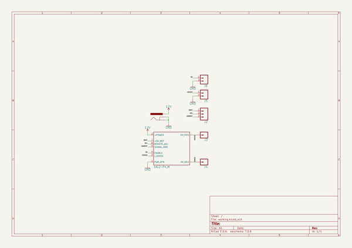
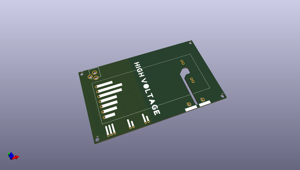
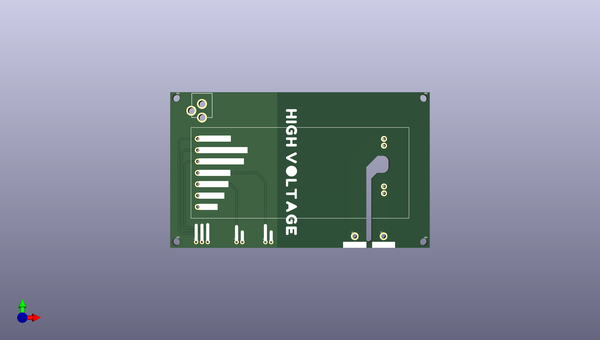
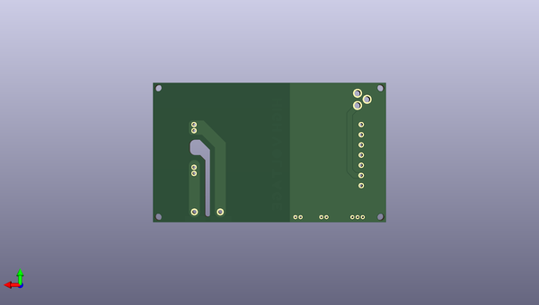

# ultravolt_dc_dc_breakout
 
## summary 
* id: npoole_ultravolt_dc_dc_breakout_ultravolt_breakout
* user: npoole
* name: ultravolt_dc_dc_breakout
* board: ultravolt_breakout
* repo: https://github.com/NPoole/Ultravolt_DC-DC_Breakout

* src_file_repo_sch: 
* src_file_repo_sch_link: https://github.com/NPoole/Ultravolt_DC-DC_Breakout/tree/main/
* full details link: https://github.com/oomlout/oomlout_oomp_project_bot_v_2/tree/main/projects/npoole_ultravolt_dc_dc_breakout_ultravolt_breakout/current_version/working  

## schematic  
  
[schematic (pdf)](working_schematic.pdf) 

## pcb  
 
  
  
  
[board (pdf)](working.pdf)  

## working_bom
| Id | Designator | Footprint | Quantity | Designation | Supplier and ref |  | None | 
| --- | --- | --- | --- | --- | --- | --- | --- | 
| 1 | U$1 | ULTRAVOLT | 1 | 1A12-P4_M |  |  | [''] | 
| 2 | U$21,U$22 | #_GND_#0 | 2 |  |  |  | [''] | 
| 3 | U$12 | #_12V_IN#0 | 1 |  |  |  | [''] | 
| 4 | J3,J4 | 1X01_2MM | 2 |  |  |  | [''] | 
| 5 | U$14 | #_#5V_REF_#0 | 1 |  |  |  | [''] | 
| 6 | J2 | 1X03_NO_SILK | 1 |  |  |  | [''] | 
| 7 | U$13 | #_GND#0 | 1 |  |  |  | [''] | 
| 8 | U$20 | #_ENABLE_#0 | 1 |  |  |  | [''] | 
| 9 | U$3,U$4,U$2,U$5 | STAND-OFF | 4 |  |  |  | [''] | 
| 10 | U$7 | #_#5V_REF#0 | 1 |  |  |  | [''] | 
| 11 | U$17 | #HV_P#0 | 1 |  |  |  | [''] | 
| 12 | J1 | POWER_JACK_PTH | 1 | POWER_JACK |  |  | [''] | 
| 13 | U$8 | #_REMOTE_ADJ#0 | 1 |  |  |  | [''] | 
| 14 | U$19 | #_I_SENSE_#0 | 1 |  |  |  | [''] | 
| 15 | U$10 | #_ENABLE#0 | 1 |  |  |  | [''] | 
| 16 | U$15 | #_ADJUST_#0 | 1 |  |  |  | [''] | 
| 17 | U$11 | #_I_SENSE#0 | 1 |  |  |  | [''] | 
| 18 | U$16 | #HV_N#0 | 1 |  |  |  | [''] | 
| 19 | J5,J6 | 1X02_NO_SILK | 2 |  |  |  | [''] | 
| 20 | U$9 | #_SIGNAL_GND#0 | 1 |  |  |  | [''] | 
| 21 | U$6 | HIGH_VOLTAGE0 | 1 |  |  |  | [''] | 
| 22 | U$18 | #_REF_GND_#0 | 1 |  |  |  | [''] | 

## bom_schematic
| Ref | Qnty | Value | Cmp name | Footprint | Description | Vendor | DNP | 
| --- | --- | --- | --- | --- | --- | --- | --- | 
| J1 | 1 | POWER_JACK | POWER_JACK | working:POWER_JACK_PTH |  |  |  | 
| J2 | 1 | CONN_031X03_NO_SILK | CONN_031X03_NO_SILK | working:1X03_NO_SILK |  |  |  | 
| J3, J4 | 2 | CONN_01PTH_2MM | CONN_01PTH_2MM | working:1X01_2MM |  |  |  | 
| J5, J6 | 2 | CONN_021X02_NO_SILK | CONN_021X02_NO_SILK | working:1X02_NO_SILK |  |  |  | 
| U$1 | 1 | 1A12-P4_M | 1A12-P4_M | working:ULTRAVOLT |  |  |  | 

