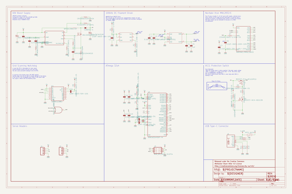
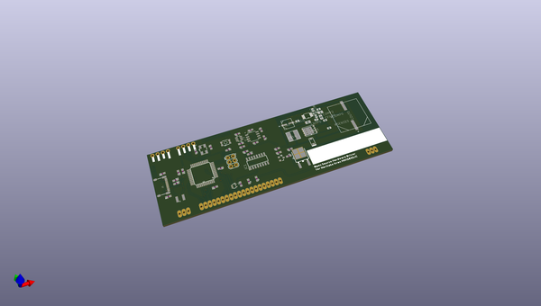
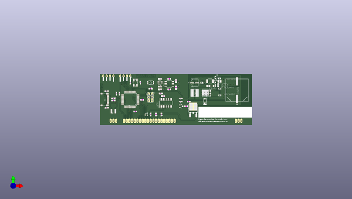
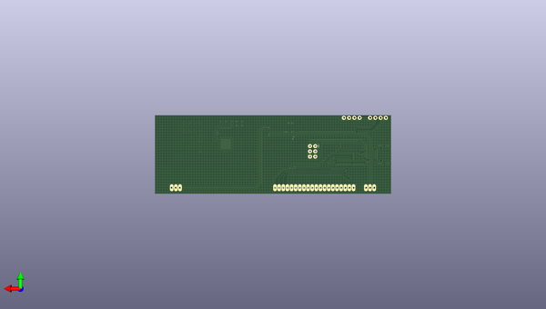

# vfdlib
 
## summary 
* id: npoole_vfdlib_noritake_itron_mn12832jc
* user: npoole
* name: vfdlib
* board: noritake_itron_mn12832jc
* repo: https://github.com/NPoole/VFDLib

* src_file_repo_sch: 
* src_file_repo_sch_link: https://github.com/NPoole/VFDLib/tree/main/
* full details link: https://github.com/oomlout/oomlout_oomp_project_bot_v_2/tree/main/projects/npoole_vfdlib_noritake_itron_mn12832jc/current_version/working  

## schematic  
  
[schematic (pdf)](working_schematic.pdf) 

## pcb  
 
  
  
  
[board (pdf)](working.pdf)  

## working_bom
| Id | Designator | Footprint | Quantity | Designation | Supplier and ref |  | None | 
| --- | --- | --- | --- | --- | --- | --- | --- | 
| 1 | U$18 | #_TXO#0 | 1 |  |  |  | [''] | 
| 2 | CCOMP0 | 0805 | 1 | 330pF |  |  | [''] | 
| 3 | R7,R14,R13 | 0603 | 3 | 22Ω |  |  | [''] | 
| 4 | F1 | 1210 | 1 | 6V/2A |  |  | [''] | 
| 5 | C8,C9 | 0603 | 2 | 22pF |  |  | [''] | 
| 6 | COUT0 | SM_RADIAL_J16 | 1 | EEV-FK2A151M |  |  | [''] | 
| 7 | C12,C6,C7,C2,C11 | 0603 | 5 | 0.1uF |  |  | [''] | 
| 8 | U$15,U$7 | #GND#0 | 2 |  |  |  | [''] | 
| 9 | U2 | 21-0041B_8_MXM | 1 | MAX628CSA+ |  |  | [''] | 
| 10 | C4,C5 | 0603 | 2 | 1nF |  |  | [''] | 
| 11 | IC1 | SOIC127P600X175-16N | 1 | CD74HC123ME4 |  |  | [''] | 
| 12 | J1,J2 | 1X04_NO_SILK | 2 |  |  |  | [''] | 
| 13 | U$3 | BLUESHIRE_SILK#SVG0 | 1 |  |  |  | [''] | 
| 14 | S1 | TACTILE_SWITCH_SMD_4.6X2.8MM | 1 | Reset |  |  | [''] | 
| 15 | U$16 | #_RXI#0 | 1 |  |  |  | [''] | 
| 16 | R6,R2,R5 | 0603 | 3 | 100k |  |  | [''] | 
| 17 | U$10,U$12 | #_5VDC#0 | 2 |  |  |  | [''] | 
| 18 | U$8 | #_SCL#0 | 1 |  |  |  | [''] | 
| 19 | CCOMP2 | 0805 | 1 | 82pF |  |  | [''] | 
| 20 | Q1 | SOT23-3 | 1 | 220mA/50V/3.5Ω |  |  | [''] | 
| 21 | CBYP0 | 0805 | 1 | 100nF |  |  | [''] | 
| 22 | U$14 | IND_NPI54C | 1 | 39uH |  |  | [''] | 
| 23 | R3,R8,RFB1,R9,R4 | 0603 | 5 | 10k |  |  | [''] | 
| 24 | U$6 | FOR_NORITAKE_ITRON_MN12832JC0 | 1 |  |  |  | [''] | 
| 25 | J3 | 2X3 | 1 | AVR_SPI_PROG_3X2PTH |  |  | [''] | 
| 26 | C3 | 0603 | 1 | 4.7uF |  |  | [''] | 
| 27 | RCOMP0 | 0603 | 1 | 332k |  |  | [''] | 
| 28 | RFILT0,R1 | 0603 | 2 | 100 |  |  | [''] | 
| 29 | U$11 | PG-TDSON-8 | 1 | 100V |  |  | [''] | 
| 30 | FRAME1 | DUMMY | 1 | FRAME-LEDGERNO_FOOTPRINT |  |  | [''] | 
| 31 | U$5 | OPEN_SOURCE_HARDWARE_DRIVER0 | 1 |  |  |  | [''] | 
| 32 | U1 | TSOT-23_6_ADI | 1 | LTC6906CS6TRPBF |  |  | [''] | 
| 33 | Q2 | TO-252_DPAK | 1 | 20A/100V/110mΩ |  |  | [''] | 
| 34 | RSYNC0 | 0603 | 1 | 26.1k |  |  | [''] | 
| 35 | CFILT0 | 0603 | 1 | 10pF |  |  | [''] | 
| 36 | Y1 | CRYSTAL-SMD-5X3.2-4PAD | 1 | 16MHz |  |  | [''] | 
| 37 | U$4 | BLUESHIRE_STOP#SVG2 | 1 |  |  |  | [''] | 
| 38 | CIN0 | SM_RADIAL_C | 1 | 22uF |  |  | [''] | 
| 39 | RSENSE0 | 0603 | 1 | 50m |  |  | [''] | 
| 40 | U3 | TQFP44 | 1 | 32U4 |  |  | [''] | 
| 41 | R11,R12 | 0603 | 2 | 5.1k |  |  | [''] | 
| 42 | U4 | SOT353 | 1 | SN74LVC1G32DCKR |  |  | [''] | 
| 43 | U$9 | #_SDA#0 | 1 |  |  |  | [''] | 
| 44 | U$13 | SOD-123 | 1 | CDBW46-G |  |  | [''] | 
| 45 | C10,C13,C1 | 0603 | 3 | 1.0uF |  |  | [''] | 
| 46 | C14 | 0603 | 1 | 10nF |  |  | [''] | 
| 47 | RFB2 | 0603 | 1 | 464k |  |  | [''] | 
| 48 | U$2 | BLUESHIRE_COPPER#SVG1 | 1 |  |  |  | [''] | 
| 49 | U$1 | MUA08A | 1 | LM3488MM/NOPB |  |  | [''] | 
| 50 | J5 | USB-C-16P-5 | 1 |  |  |  | [''] | 
| 51 | U$17 | NORITAKE_ITRON_128X32 | 1 | NORITAKE_ITRON_128X32 |  |  | [''] | 

## bom_schematic
| Ref | Qnty | Value | Cmp name | Footprint | Description | Vendor | DNP | 
| --- | --- | --- | --- | --- | --- | --- | --- | 
| C1, C10, C13 | 3 | 1.0UF-0603-16V-10% | 1.0UF-0603-16V-10% | working:0603 |  |  |  | 
| C2, C7, C11, C12 | 4 | 0.1UF-0603-25V-(+80/-20%) | 0.1UF-0603-25V-(+80/-20%) | working:0603 |  |  |  | 
| C3 | 1 | 4.7UF-0603-35V-(20%) | 4.7UF-0603-35V-(20%) | working:0603 |  |  |  | 
| C4, C5 | 2 | 1nF | 1.0NF/1000PF-0603-50V-10% | working:0603 |  |  |  | 
| C6 | 1 | 0.1UF-0603-100V-10% | 0.1UF-0603-100V-10% | working:0603 |  |  |  | 
| C8, C9 | 2 | 22PF-0603-50V-5% | 22PF-0603-50V-5% | working:0603 |  |  |  | 
| C14 | 1 | 10NF-0603-50V-10% | 10NF-0603-50V-10% | working:0603 |  |  |  | 
| CBYP0 | 1 | CL21C100JBANNNC | CL21C100JBANNNC | working:0805 |  |  |  | 
| CCOMP0 | 1 | CL21C331JBANNNC | CL21C331JBANNNC | working:0805 |  |  |  | 
| CCOMP2 | 1 | CL21C820JBANNNC | CL21C820JBANNNC | working:0805 |  |  |  | 
| CFILT0 | 1 | GRM188R70J104KA01D | GRM188R70J104KA01D | working:0603 |  |  |  | 
| CIN0 | 1 | EEE-FK1C220R | EEE-FK1C220R | working:SM_RADIAL_C |  |  |  | 
| COUT0 | 1 | EEV-FK2A151M | EEV-FK2A151M | working:SM_RADIAL_J16 |  |  |  | 
| F1 | 1 | PPTC_6V2A | PPTC_6V2A | working:1210 |  |  |  | 
| FRAME1 | 1 | FRAME-LEDGERNO_FOOTPRINT | FRAME-LEDGERNO_FOOTPRINT | working:DUMMY |  |  |  | 
| IC1 | 1 | CD74HC123ME4 | CD74HC123ME4 | working:SOIC127P600X175-16N |  |  |  | 
| J1, J2 | 2 | CONN_041X04_NO_SILK | CONN_041X04_NO_SILK | working:1X04_NO_SILK |  |  |  | 
| J3 | 1 | AVR_SPI_PROG_3X2PTH | AVR_SPI_PROG_3X2PTH | working:2X3 |  |  |  | 
| J5 | 1 | USB_C5 | USB_C5 | working:USB-C-16P-5 |  |  |  | 
| Q1 | 1 | MOSFET-NCH-BSS138 | MOSFET-NCH-BSS138 | working:SOT23-3 |  |  |  | 
| Q2 | 1 | MOSFET_PCH-MCU20P10 | MOSFET_PCH-MCU20P10 | working:TO-252_DPAK |  |  |  | 
| R1 | 1 | 100OHM-0603-1/10W-1% | 100OHM-0603-1/10W-1% | working:0603 |  |  |  | 
| R2, R5, R6 | 3 | 100KOHM-0603-1/10W-1% | 100KOHM-0603-1/10W-1% | working:0603 |  |  |  | 
| R3, R4, R8, R9 | 4 | 10KOHM-0603-1/10W-1% | 10KOHM-0603-1/10W-1% | working:0603 |  |  |  | 
| R7, R13, R14 | 3 | 22OHM-0603-1/10W-1% | 22OHM-0603-1/10W-1% | working:0603 |  |  |  | 
| R11, R12 | 2 | 5.1k | 5.1KOHM5.1KOHM-0603-1/10W-1% | working:0603 |  |  |  | 
| RCOMP0 | 1 | CRCW0603332KFKEA | CRCW0603332KFKEA | working:0603 |  |  |  | 
| RFB1 | 1 | CRCW060310K0FKEA | CRCW060310K0FKEA | working:0603 |  |  |  | 
| RFB2 | 1 | RC0603FR-07464KL | RC0603FR-07464KL | working:0603 |  |  |  | 
| RFILT0 | 1 | CRCW0603100RFKEA | CRCW0603100RFKEA | working:0603 |  |  |  | 
| RSENSE0 | 1 | ERJ-L03KF50MV | ERJ-L03KF50MV | working:0603 |  |  |  | 
| RSYNC0 | 1 | RC0603FR-0726K1L | RC0603FR-0726K1L | working:0603 |  |  |  | 
| S1 | 1 | MOMENTARY-SWITCH-SPST-SMD-4.6X2.8MM | MOMENTARY-SWITCH-SPST-SMD-4.6X2.8MM | working:TACTILE_SWITCH_SMD_4.6X2.8MM |  |  |  | 
| U1 | 1 | LTC6906CS6TRPBF | LTC6906CS6TRPBF | working:TSOT-23_6_ADI |  |  |  | 
| U2 | 1 | MAX628CSA+ | MAX628CSA+ | working:21-0041B_8_MXM |  |  |  | 
| U3 | 1 | ATMEGA32U4TQFP-44 | ATMEGA32U4TQFP-44 | working:TQFP44 |  |  |  | 
| U4 | 1 | SN74LVC1G32DCKR | 7432 | working:SOT353 |  |  |  | 
| U$1 | 1 | LM3488MM/NOPB | LM3488MM/NOPB | working:MUA08A |  |  |  | 
| U$11 | 1 | BSC265N10LSF_G | BSC265N10LSF_G | working:PG-TDSON-8 |  |  |  | 
| U$13 | 1 | CDBW46-G | CDBW46-G | working:SOD-123 |  |  |  | 
| U$14 | 1 | NPI54C390KTRF | NPI54C390KTRF | working:IND_NPI54C |  |  |  | 
| U$17 | 1 | NORITAKE_ITRON_128X32 | NORITAKE_ITRON_128X32 | working:NORITAKE_ITRON_128X32 |  |  |  | 
| Y1 | 1 | 16MHz | CRYSTAL-16MHZSMD-5X3.2 | working:CRYSTAL-SMD-5X3.2-4PAD |  |  |  | 

